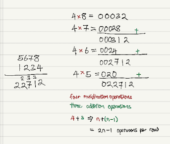
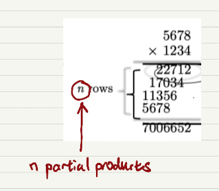

# 1.2.3 The Grade-School Algorithm

$$
2n-1 \text{ operations per row} \\ 
n \text{ partial products} \\ 
\text{Total operations} = n(2n-1) \\ 
= 2n \cdot n - n \\ 
= 2n^2 - n \\ 
\approx 2n^2
$$

