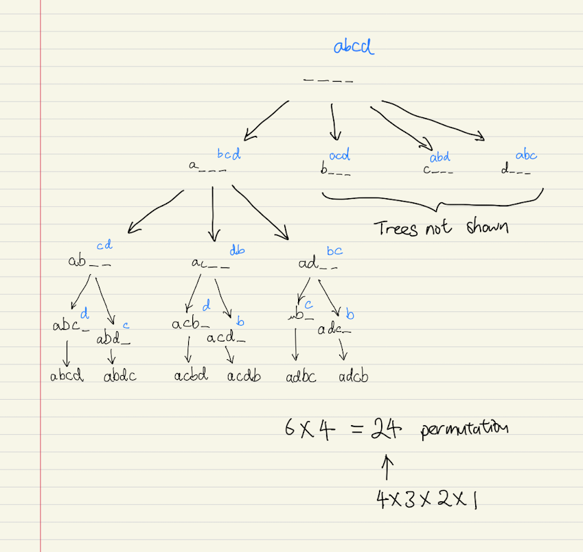
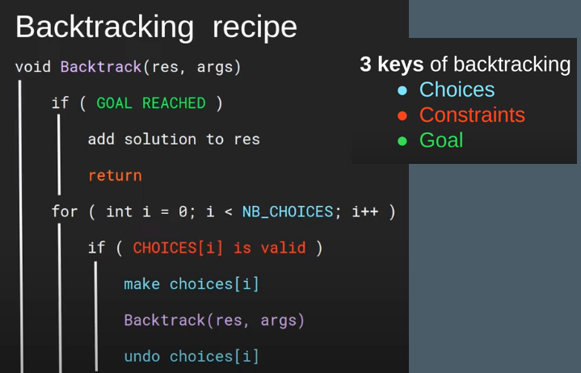

# String permutation with backtrack

Given 4 characters:

```
"a", "b", "a", "d"
```
Find all posiblity of arranging this 4 characters into a string using the **backtracking** algorithm.

Solution:

````
[
  'abcd', 'abdc', 'acbd',
  'acdb', 'adbc', 'adcb',
  'bacd', 'badc', 'bcad',
  'bcda', 'bdac', 'bdca',
  'cabd', 'cadb', 'cbad',
  'cbda', 'cdab', 'cdba',
  'dabc', 'dacb', 'dbac',
  'dbca', 'dcab', 'dcba'
]
````


Note:






---

Reference:

[https://www.youtube.com/watch?v=Nabbpl7y4Lo](https://www.youtube.com/watch?v=Nabbpl7y4Lo)

[https://www.youtube.com/watch?v=GCm7m5671Ps](https://www.youtube.com/watch?v=GCm7m5671Ps)


